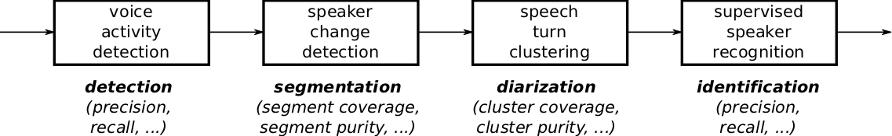

#################
Command line tool
#################

There are two main issues that may arise with results reported in the literature:

 * Even though the same public datasets are used, the actual evaluation protocol may differ slightly from one paper to another.
 * The implementation of the reported evaluation metrics may also differ.

The first objective of the `pyannote.metrics` library is to address these two problems, and provide a convenient way for researchers to evaluate their approaches in a reproducible and comparable manner.

Here is an example use of the command line interface that is provided to solve this problem.

.. code-block:: bash

    $ pyannote-metrics diarization --subset=development Etape.SpeakerDiarization.TV hypothesis.rttm

    Diarization (collar = 0 ms)               error    purity    coverage     total    correct      %    fa.      %    miss.     %    conf.      %
    --------------------------------------  -------  --------  ----------  --------  ---------  -----  ------  -----  -------  ----  -------  -----
    BFMTV_BFMStory_2011-03-17_175900          14.64     94.74       90.00   2582.08    2300.22  89.08   96.16   3.72    80.14  3.10   201.72   7.81
    LCP_CaVousRegarde_2011-02-17_204700       17.80     89.13       86.90   3280.72    2848.42  86.82  151.78   4.63   208.29  6.35   224.01   6.83
    LCP_EntreLesLignes_2011-03-18_192900      23.46     79.52       79.03   1704.97    1337.80  78.46   32.89   1.93   157.14  9.22   210.03  12.32
    LCP_EntreLesLignes_2011-03-25_192900      26.75     76.97       75.86   1704.13    1292.83  75.86   44.61   2.62   158.38  9.29   252.92  14.84
    LCP_PileEtFace_2011-03-17_192900          10.73     93.33       92.30   1611.49    1487.32  92.30   48.73   3.02    55.49  3.44    68.67   4.26
    LCP_TopQuestions_2011-03-23_213900        18.28     98.25       94.20    727.26     668.65  91.94   74.36  10.22    16.41  2.26    42.20   5.80
    LCP_TopQuestions_2011-04-05_213900        27.97     97.95       79.81    818.03     638.68  78.08   49.45   6.04    17.46  2.13   161.89  19.79
    TV8_LaPlaceDuVillage_2011-03-14_172834    21.43     92.89       89.64    996.12     892.04  89.55  109.36  10.98    11.80  1.18    92.28   9.26
    TV8_LaPlaceDuVillage_2011-03-21_201334    66.23     77.24       70.64   1296.86     691.76  53.34  253.80  19.57    29.16  2.25   575.95  44.41
    TOTAL                                     23.27     88.18       84.55  14721.65   12157.71  82.58  861.14   5.85   734.28  4.99  1829.67  12.43

Tasks
-----

Not only can ``pyannote-metrics`` command line tool be used to compute the diarization error rate using NIST implementation, one can also evaluate the typical four sub-modules used in  most speaker diarization systems:

Practically, the first positional argument (e.g. ``diarization``, above) is a flag indicating which task should be evaluated.

Apart from the ``diarization`` flag that is used for evaluating speaker diarization results, other available flags are ``detection`` (speech activity detection), ``segmentation`` (speaker change detection), and ``identification`` (supervised speaker identification).
Depending on the task, a different set of evaluation metrics is computed.

Datasets and protocols
----------------------

``pyannote.metrics`` provides an easy way to ensure the same protocol (i.e. manual groundtruth and training/development/test split) is used for evaluation.

Internally, it relies on a collection of Python packages that all derive from the ``pyannote.database`` main package, that provides a convenient API to define training/development/test splits, along with groundtruth annotations.
In the example above, the `development` set of the `TV` evaluation protocol of the ETAPE dataset is used.

Results are both reported for each file in the selected subset, and aggregated into one final metric value.

As of March 2017, ``pyannote.database`` packages exist for the ETAPE corpus, the REPERE corpus, and the AMI corpus. As more people contribute new ``pyannote.database`` packages, they will be added to the `pyannote` ecosystem.

File formats
------------

Hypothesis files must use the [Rich Transcription Time Marked](https://web.archive.org/web/20170119114252/http://www.itl.nist.gov/iad/mig/tests/rt/2009/docs/rt09-meeting-eval-plan-v2.pdf) (RTTM) format.
