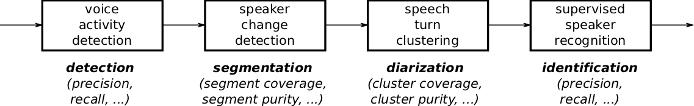

#########
Reference
#########

******************
Evaluation metrics
******************

.. toctree::
   :maxdepth: 3

Here is a typical speaker diarization pipeline:

The first step is usually dedicated to speech activity detection, where the objective is to get rid of all non-speech regions.
Then, speaker change detection aims at segmenting speech regions into homogeneous segments.
The subsequent clustering step tries to group those speech segments according to the identity of the speaker.
Finally, an optional supervised classification step may be applied to actually identity every speaker cluster in a supervised way.

Looking at the final performance of the system is usually not enough for diagnostic purposes.
In particular, it is often necessary to evaluate the performance of each module separately to identify their strenght and weakness, or to estimate the influence of their errors on the complete pipeline.

Here, we provide the list of metrics that were implemented in `pyannote.metrics` with that very goal in mind.

Because manual annotations cannot be precise at the audio sample level, it is common in speaker diarization research to remove from evaluation a 500ms collar around each speaker turn boundary (250ms before and after).
Most of the metrics available in `pyannote.metrics` support a `collar` parameter, which defaults to 0.

Moreover, though audio files can always be processed entirely (from beginning to end), there are cases where reference annotations are only available for some regions of the audio files.
All metrics support the provision of an evaluation map that indicate which part of the audio file should be evaluated.

Detection
---------

The two primary metrics for evaluating speech activity detection modules are detection error rate and detection cost function.

Detection error rate (not to be confused with diarization error rate) is defined as:

.. math::
  \text{detection error rate} = \frac{\text{false alarm} + \text{missed detection}}{\text{total}}

where :math:`\text{false alarm}` is the duration of non-speech incorrectly classified as speech, :math:`\text{missed detection}` is the duration of speech incorrectly classified as non-speech, and :math:`\text{total}` is the total duration of speech in the reference.

Alternately, speech activity module output may be evaluated in terms of detection cost function, which is defined as:

.. math::                                                                   
  \text{detection cost function} = 0.25 \times \text{false alarm rate} + 0.75 \times \text{miss rate} 

where :math:`\text{false alarm rate}` is the proportion of non-speech incorrectly classified as speech and :math:`\text{miss rate}` is the proportion of speech incorrectly classified as non-speech.

Additionally, detection may be evaluated in terms of accuracy (proportion of the input signal correctly classified), precision (proportion of detected speech that is speech), and recall (proporton of speech that is detected).

.. automodule:: pyannote.metrics.detection
   :members:

Segmentation
------------

Change detection modules can be evaluated using two pairs of dual metrics: precision and recall, or purity and coverage.

.. image:: images/segmentation.png

Precision and recall are standard metrics based on the number of correctly detected speaker boundaries. Recall is 75% because 3 out of 4 reference boundaries were correctly detected, and precision is 100% because all hypothesized boundaries are correct.

The main weakness of that pair of metrics (and their combination into a f-score) is that it is very sensitive to the `tolerance` parameter, i.e. the maximum distance between two boundaries for them to be matched. From one segmentation paper to another, authors may used very different values, thus making the approaches difficult to compare.

Instead, we think that segment-wise purity and coverage should be used instead.
They have several advantages over precision and recall, including the fact that they do not depend on any `tolerance` parameter, and that they directly relate to the cluster-wise purity and coverage used for evaluating speaker diarization.

Segment-wise coverage is computed for each segment in the reference as the ratio of the duration of the intersection with the most co-occurring hypothesis segment and the duration of the reference segment.
For instance, coverage for reference segment 1 is 100% because it is entirely covered by hypothesis segment A.

Purity is the dual metric that indicates how `pure` hypothesis segments are. For instance, segment A is only 65% pure because it is covered at 65% by segment 1 and 35% by segment 2.

The final values are duration-weighted average over each segment.

.. automodule:: pyannote.metrics.segmentation
   :members:

Diarization
-----------

Diarization error rate (DER) is the \emph{de facto} standard metric for evaluating and comparing speaker diarization systems.
It is defined as follows:

.. math::

    \text{DER} = \frac{\text{false alarm} + \text{missed detection} + \text{confusion}}{\text{total}}

where :math:`\text{false alarm}` is the duration of non-speech incorrectly classified as speech, :math:`\text{missed detection}` is the duration of
speech incorrectly classified as non-speech, :math:`\text{confusion}` is the duration of speaker confusion, and :math:`\text{total}` is the sum over all speakers of their reference speech duration.

Note that this metric does take overlapping speech into account, potentially leading to increased missed detection in case the speaker diarization system does not include an overlapping speech detection module.

Optimal vs. greedy
******************

Two implementations of the diarization error rate are available (optimal and greedy), depending on how the one-to-one mapping between reference and hypothesized speakers is computed.

The `optimal` version uses the Hungarian algorithm to compute the mapping that minimize the confusion term, while the `greedy` version operates in a greedy manner, mapping reference and hypothesized speakers iteratively, by decreasing value of their cooccurrence duration.

In practice, the `greedy` version is much faster than the `optimal` one, especially for files with a large number of speakers -- though it may slightly over-estimate the value of the diarization error rate.

Purity and coverage
*******************

While the diarization error rate provides a convenient way to compare different diarization approaches, it is usually not enough to understand the type of errors commited by the system.

Purity and coverage are two dual evaluation metrics that provide additional insight on the behavior of the system.

.. math::

   \text{purity} & = & \frac{\displaystyle \sum_{\text{cluster}} \max_{\text{speaker}} |\text{cluster} \cap \text{speaker}|  }{\displaystyle \sum_{\text{cluster}} |\text{cluster}|} \\
  \text{coverage} & = & \frac{\displaystyle \sum_{\text{speaker}} \max_{\text{cluster}} |\text{speaker} \cap \text{cluster}|  }{\displaystyle \sum_{\text{speaker}} |\text{speaker}|} \\

where :math:`|\text{speaker}|` (respectively :math:`|\text{cluster}|`) is the speech duration of this particular reference speaker (resp. hypothesized cluster), and  :math:`|\text{speaker} \cap \text{cluster}|` is the duration of their intersection.

Over-segmented results (e.g. too many speaker clusters) tend to lead to high purity and low coverage, while under-segmented results (e.g. when two speakers are merged into one large cluster) lead to low purity and higher coverage.

Use case
********

This figure depicts the evolution of a multi-stage speaker diarization system applied on the ETAPE dataset.
It is roughly made of four consecutive modules (segmentation, BIC clustering, Viterbi resegmentation, and CLR clustering).

.. image:: images/diagnostic.png

From the upper part of the figure (DER as a function of the module), it is clear that each module improves the output of the previous one.

Yet, the lower part of the figure clarifies the role of each module.
BIC clustering tends to increase the size of the speaker clusters, at the expense of purity (-7%).
Viterbi resegmentation addresses this limitation and greatly improves cluster purity (+5%), with very little impact on the actual cluster coverage (+2%).
Finally, CLR clustering brings an additional +5% coverage improvement.

.. automodule:: pyannote.metrics.diarization
   :members:

.. automodule:: pyannote.metrics.matcher
   :members:

Identification
--------------

In case prior speaker models are available, the speech turn clustering module may be followed by a supervised speaker recognition module for cluster-wise supervised classification.

`pyannote.metrics` also provides a collection of evaluation metrics for this identification task. This includes precision, recall, and identification error rate (IER):

.. math::
  \text{IER} = \frac{\text{false alarm} + \text{missed detection} + \text{confusion}}{\text{total}}

which is similar to the diarization error rate (DER) introduced previously, except that the :math:`\texttt{confusion}` term is computed directly by comparing reference and hypothesis labels, and does not rely on a prior one-to-one matching.

.. automodule:: pyannote.metrics.identification
   :members:

**************
Error analysis
**************

Segmentation
============

.. automodule:: pyannote.metrics.errors.segmentation
   :members:

Identification
==============

.. automodule:: pyannote.metrics.errors.identification
  :members:

*****
Plots
*****

Binary classification
=====================

.. automodule:: pyannote.metrics.plot.binary_classification
  :members:
